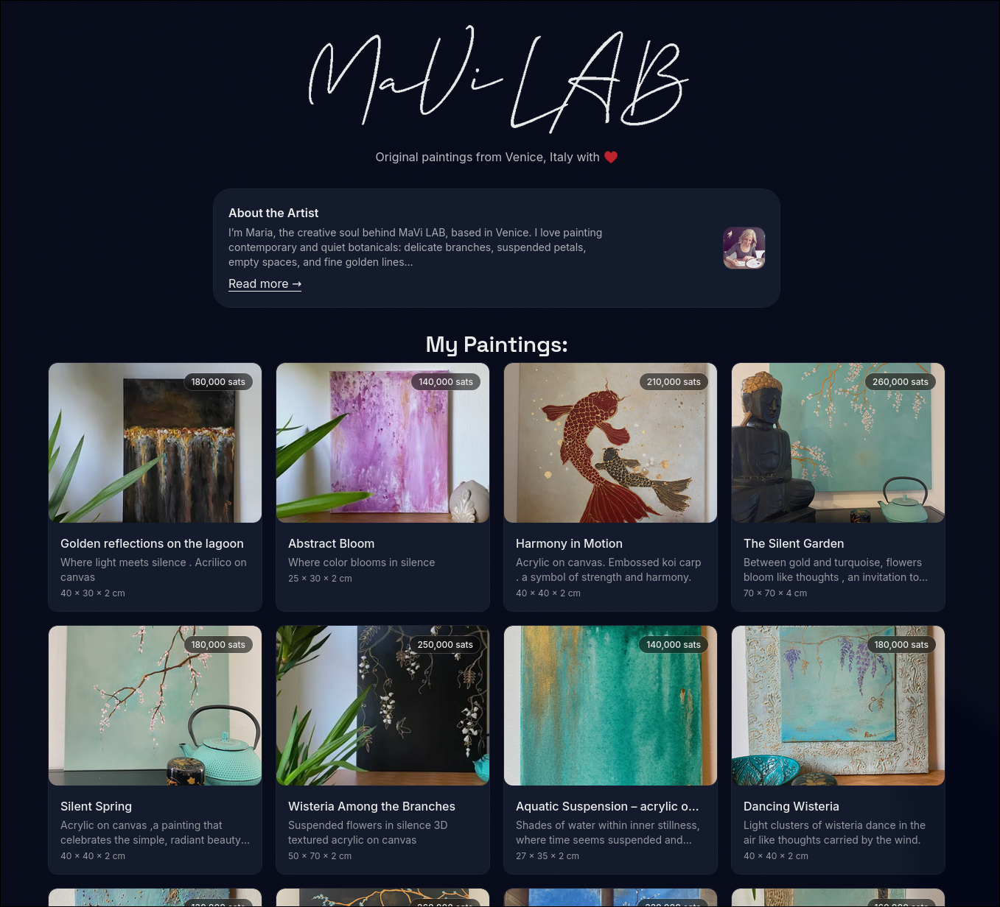
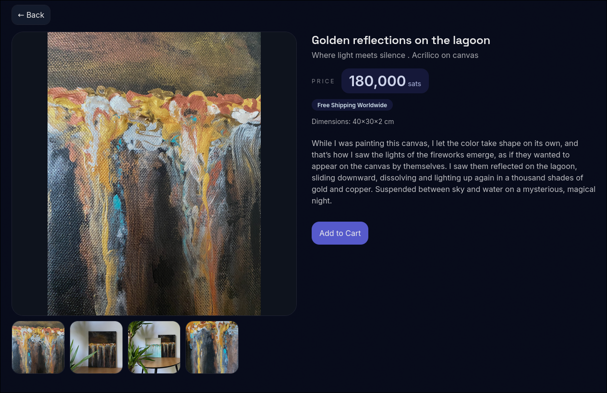
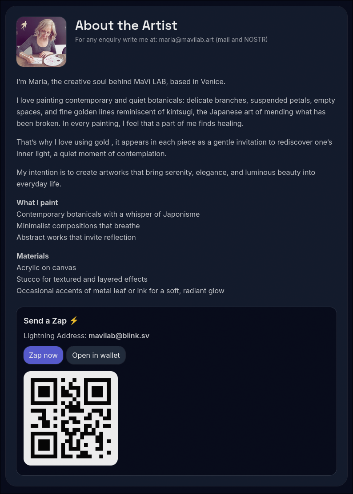
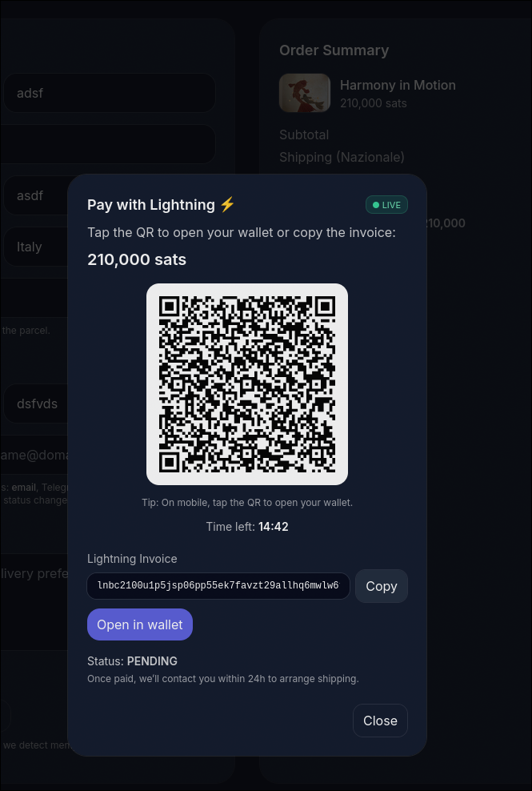
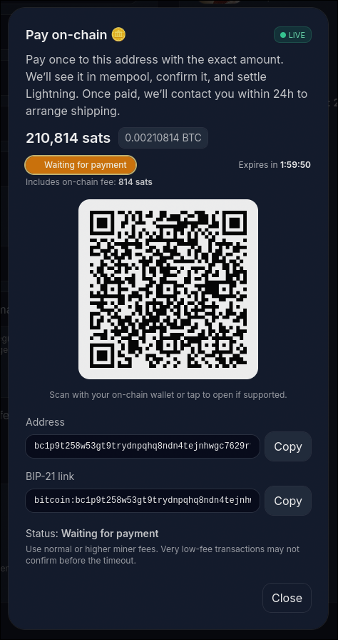
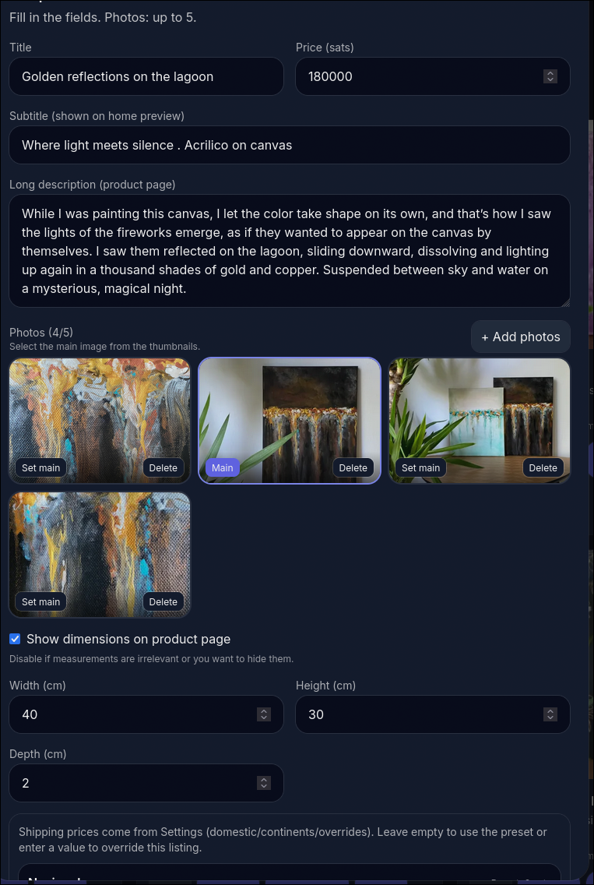
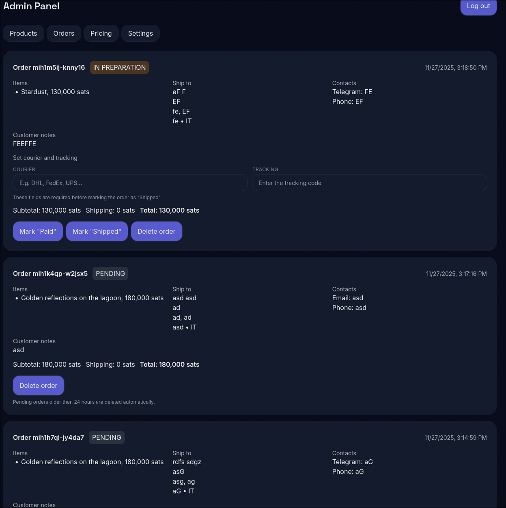
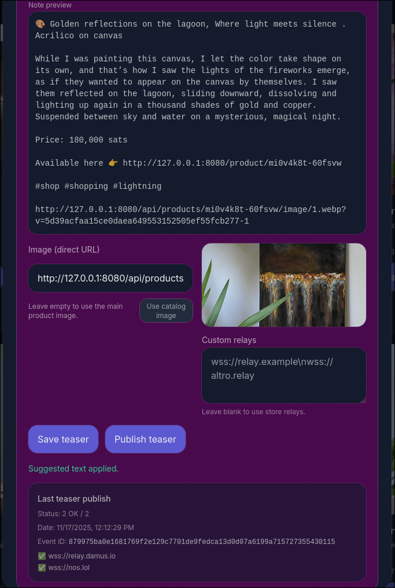

# BoltCanvas ⚡

BoltCanvas is a small, opinionated shop template:

- A clean public gallery where people can browse your products.
- A simple admin area where you manage products, texts and orders.
- Bitcoin-only payments in **sats** (Blink or LND), with the option to let buyers pay **on-chain** while you still receive Lightning.
- **on-chain** payments settle via lightning through BOLTZ. But once set up, neither you nor your 
- **extremely** lightweight.

To have an idea how it look, go here: [MaviLab](https://mavilab.art)

---

## What it looks like

### Storefront

The homepage is a simple grid of items with large images and clear prices.



Visitors can click into a product to see details, more photos and the Lightning price.



The “About” page is fully editable from the admin: photo, text, contact note, Nostr identity and Lightning address.



---

### Paying with Lightning and on-chain

At checkout, buyers choose how to pay:

- **Lightning** – QR + BOLT11 invoice, with live status until paid or expired.
- **On-chain (Boltz)** – a single Bitcoin address and amount; as soon as the transaction appears in mempool and confirms, the Lightning invoice is paid in the background and the order is marked as paid.





Both paths end in the same “Payment received” page and the admin sees the order as PAID.

---

### Admin: products, settings, orders

The admin lives at `/admin` and is protected by a simple PIN.

- Add and edit items with multiple photos, prices and shipping presets.
- Reorder products with drag & drop.



- Tune the look & feel: title, hero text, shipping copy, about text, theme and more.


- Track orders, update their status (`PAID`, `PREPARATION`, `SHIPPED`), and add courier + tracking.



If you enable email and/or ntfy, each status change can also notify the buyer and yourself.

---

### Nostr extras (optional)

If you use Nostr, you can:

- Show your npub and NIP-05 on the About page.
- Log buyers in with Nostr so their carts and order history follow them.
- Create and publish simple teaser posts for each item with one click.



All the Nostr parts are optional; if you don’t configure them, the shop still works as a normal Lightning store.

---

## How payments work

- **Lightning (Blink or LND)**  
  When a buyer checks out, the server creates a Lightning invoice in sats.  
  The checkout page shows a QR and tracks the invoice until it is paid or expires.

- **On-chain via Boltz (Submarine swap)**  
  For buyers who prefer on-chain:
  1. The shop still creates a normal Lightning invoice in the background.
  2. A Boltz “Submarine swap” turns that invoice into a one-time Bitcoin address and amount.
  3. The buyer sends a single on-chain payment to that address.
  4. As soon as the transaction hits mempool and then confirms, Boltz pays your Lightning invoice.
  5. The order flips to PAID, the item is marked SOLD, and your “Payment received” page appears.

From the buyer’s point of view: Lightning is instant; on-chain shows a mempool/confirmation progress and then the same receipt.

---

## What you need to run it

- Node.js. Have a look here if you have not installed it yet [Node.js installation guide](https://nodejs.org/en/download)
- One of:
  - A **Blink** account (recommended): API key can be generated here [Create a Blink API key](https://dashboard.blink.sv/api-keys) . 
  - Your own **LND** node: REST URL + macaroon + TLS details (for expert and self sovreign users 💪).
- Optional:
  - SMTP/IMAP for email updates.
  - Nostr keys if you want Nostr features.
  - ntfy for push-style order notifications (recommended).

---

## Production setup

The default example config (`server/.env.example`) is designed to be a good starting point for **production**.

### 1. Install and build
From the project root:

```bash
cd server && npm install
cd ../client && npm install
cd client && npm run build
```

This produces the static frontend in `client/dist/`.

### 2. Configure `server/.env` for production

```bash
cd server
cp .env.example .env
```

Open `server/.env` and configure it to your like.

### 3. Run the server

From `server/`:

```bash
npm start
```

The server will:

- Serve the built frontend from `../client/dist`.
- Expose the API on `PORT` (default `8080`).

For a real deployment, run this behind:

- A process manager like `pm2` or `systemd`.
- A reverse proxy or Cloudflare Tunnel that terminates HTTPS and forwards to your Node server.
- `/admin` path exposes 

### 4. First-time setup in the browser

Once the server is running and reachable at your domain:

1. Go to `http://127.0.0.1:8080/admin` or `https://shop.example.com/admin`.
2. Log in with your `ADMIN_PIN` as set in .env .
3. From the admin dashboard, update:
   - Store name and hero line and logo pictures.
   - About section text and photo.
   - Shipping info block and commission/contact copy.
   - Nostr + Lightning address (if used).

All these can be changed later without redeploying.
More advanced configuration (payment provider, SMTP, webhooks, ntfy, etc.) is done in `server/.env`.

If you’re unsure about an option, you can usually leave the value from `.env.example` and the app will still work.
